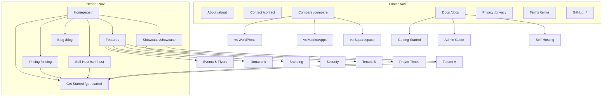

# OpenMasjid Marketing Site — Architecture

*Site lives at `openmasjid.app` (the platform domain). Tenant sites live at `*.openmasjid.app` and on custom domains.*

---

## 1. Page Hierarchy

```
Homepage (/)
├── Features (/features)
│   ├── Prayer Times (/features/prayer-times)
│   ├── Events & Flyers (/features/events)
│   ├── Donations (/features/donations)
│   ├── Branding & Themes (/features/branding)
│   └── Security (/features/security)
├── Pricing (/pricing)
├── Showcase (/showcase)              ← hidden until 2–3 named tenants live
│   └── [Tenant detail] (/showcase/[slug])
├── Compare (/compare)
│   ├── vs WordPress (/compare/wordpress)
│   ├── vs MadinaApps (/compare/madinaapps)
│   └── vs Squarespace (/compare/squarespace)
├── Self-Host (/self-host)
├── Docs (/docs)            ← linked out to docs subdomain or /docs/*
│   ├── Getting Started (/docs/getting-started)
│   ├── Admin Guide (/docs/admin)
│   ├── Branding (/docs/branding)
│   ├── Custom Domain (/docs/custom-domain)
│   └── Self-Hosting (/docs/self-hosting)
├── Blog (/blog)
│   └── [Post] (/blog/{slug})
├── About (/about)
├── Contact (/contact)
├── Get Started (/get-started)        ← signup / claim subdomain
└── Legal
    ├── Privacy (/privacy)
    └── Terms (/terms)
```

**Depth:** 3 levels max. Every important page is ≤2 clicks from the homepage.

---

## 2. Visual Sitemap



---

## 3. URL Map

| Page | URL | Parent | Nav Location | Priority |
|------|-----|--------|--------------|----------|
| Homepage | `/` | — | Logo + header | High |
| Features (overview) | `/features` | Home | Header (dropdown) | High |
| Prayer Times | `/features/prayer-times` | Features | Dropdown | High |
| Events & Flyers | `/features/events` | Features | Dropdown | High |
| Donations | `/features/donations` | Features | Dropdown | High |
| Branding & Themes | `/features/branding` | Features | Dropdown | Medium |
| Security | `/features/security` | Features | Dropdown | Medium |
| Pricing | `/pricing` | Home | Header | High |
| Showcase | `/showcase` | Home | Header | Medium |
| Tenant case study | `/showcase/[slug]` | Showcase | — | Medium |
| Self-Host | `/self-host` | Home | Header | High |
| Compare hub | `/compare` | Home | Footer | Medium |
| vs WordPress | `/compare/wordpress` | Compare | — | High (SEO) |
| vs MadinaApps | `/compare/madinaapps` | Compare | — | High (SEO) |
| vs Squarespace | `/compare/squarespace` | Compare | — | Medium (SEO) |
| Docs | `/docs` | Home | Footer + header (small) | Medium |
| Blog | `/blog` | Home | Header | Medium |
| Blog post | `/blog/[slug]` | Blog | — | Varies |
| About | `/about` | Home | Footer | Low |
| Contact | `/contact` | Home | Footer | Low |
| Get Started | `/get-started` | Home | Header CTA | High |
| Privacy | `/privacy` | Home | Footer | Low |
| Terms | `/terms` | Home | Footer | Low |

**URL conventions:** lowercase, hyphenated, no trailing slash, no dates in slugs.

---

## 4. Navigation Spec

### Header (left → right)
1. **Logo** → `/`
2. **Features** (dropdown — 6 sub-items)
3. **Pricing** → `/pricing`
4. **Showcase** → `/showcase`
5. **Self-Host** → `/self-host`
6. **Blog** → `/blog`
7. **Sign In** → `admin.openmasjid.app` (text link)
8. **Get Started** → `/get-started` (primary CTA button)

### Footer (4 columns)

**Product**
- Features
- Pricing
- Showcase
- Compare alternatives
- Changelog

**For Masajid**
- Get started
- Self-host
- Migration help
- Custom domain

**Resources**
- Docs
- Blog
- GitHub ↗
- Status

**Company**
- About
- Contact
- Privacy
- Terms

Bottom strip: Copyright • "Built with niyyah for the ummah" • social icons (X, GitHub, LinkedIn).

### Breadcrumbs
Enabled on all `/features/*`, `/compare/*`, `/showcase/*`, `/blog/*`, `/docs/*`. Mirrors URL.

---

## 5. Internal Linking Plan

### Hubs and spokes

| Hub | Spokes |
|-----|--------|
| `/features` | All 6 feature pages — each spoke links back to hub + 2 sibling features |
| `/compare` | 3 comparison pages — each links back to `/compare` and to `/pricing` |
| `/showcase` | Each tenant case study links back + to `/get-started` |
| `/blog` (pillar: "Choosing a masjid website platform") | All comparison + features + migration posts link back |

### Cross-section links

- **Feature page → Showcase:** "See it in production" linking to a representative tenant detail page (once published)
- **Feature page → Pricing:** soft CTA mid-page
- **Feature page → Self-Host:** "Want to run this yourself? [Self-host the same code](/self-host)"
- **Compare page → Showcase + Pricing:** end-of-page CTAs
- **Pricing → Compare:** "Already on WordPress? [See the migration math](/compare/wordpress)"
- **Homepage → Showcase:** social-proof strip
- **About → GitHub:** open-source credibility

### Internal-link rules
- Every page: ≥1 inbound link from a higher-traffic page
- Anchor text: descriptive (e.g., "claim a free `.openmasjid.app` subdomain"), never "click here"
- Each feature page: 5–8 internal links in body
- All blog posts: link to ≥1 feature page + ≥1 comparison page
